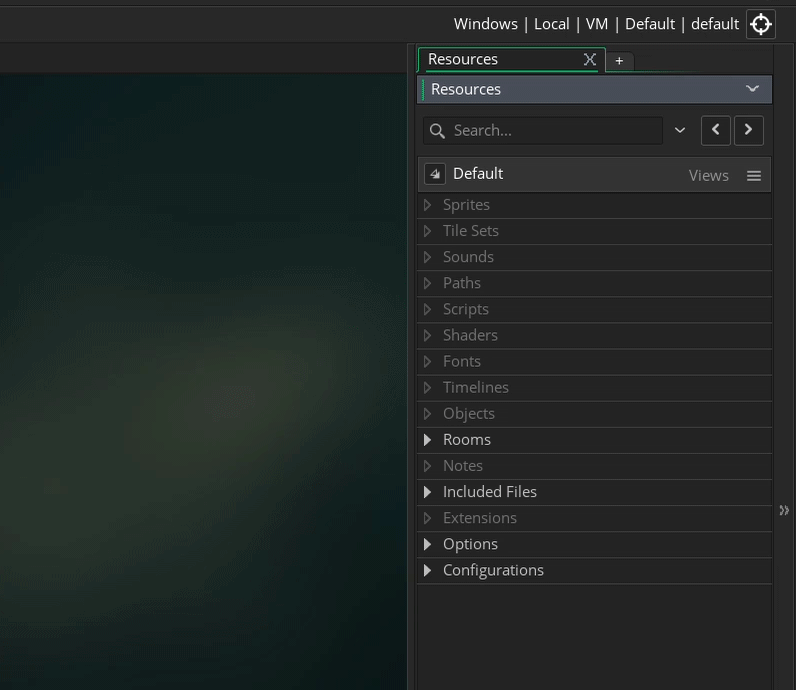
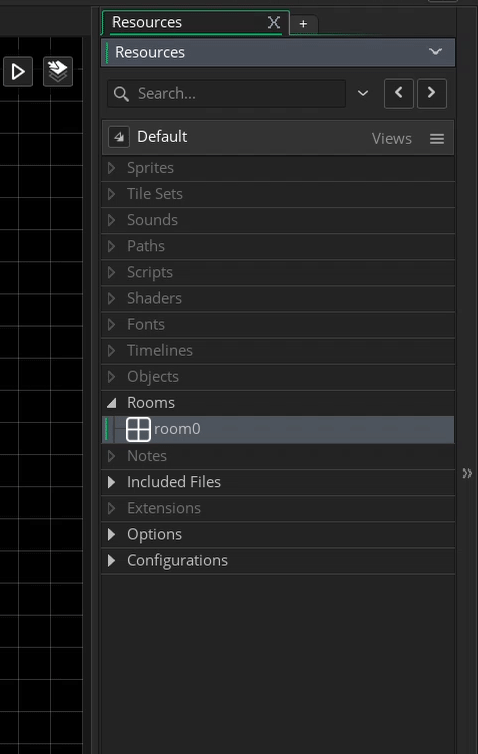

### GMS 2 Positioning Text

This tutorial is intended for those wanting an introduction to <i>GameMaker Studio 2</i> using their scrpting language <i>GML</i>. This assumes no prior knowledge of the software or scripting. This walk through looks at how to add text to a 2-D game level and position it in the dead center on screen.

* Tested on GameMake Studio2.3.5.589
* An existing [GML Project](https://github.com/maubanel/GMS2-Snippets/blob/main/rename-project/README.md#user-content-rename-gms2-project)

 

---

##### `Step 1.`\|`ITA`|:small_blue_diamond:

In GameMaker all of our resources are stored in the **Resources** menu.  By default it is in the right hand side of the screen (although you can change its location as these tabs can be redocked).  Each of these sections have a small triangle that can be expanded or minimized to show the assets of that class.  All of our art, audio, scripting and other elements will be stored here in the appropriate folder.  

All projects in **GameMaker Studio 2** start with a room called **room0**. A room represents a level of your game.  You can have multiple rooms thus multiple levels. If you don't see the room in the **Resources** menu then *press the right arrow* next to the **Rooms** title to open up all the rooms in this folder. Double left click **room0** to open it.  If you don't see the room in the editor, you can then *press the middle Zoom icon* with the **=** in it to reset the zoom level.

##### `Step 2.`\|`FHIU`|:small_blue_diamond: :small_blue_diamond: 

Now we should rename the room to something more appropriate.  It is a good idea to always preface the names with what Resource type we are using.  We will prepend the room names with `rm_` and call it `rm_hello_world` by *right clicking* on the room and selecting **Rename**</b> from the drop down menu and then type in the new name for the room.

##### `Step 3.`\|`ITA`|:small_blue_diamond: :small_blue_diamond: :small_blue_diamond:

Go to the **Resources** menu on the right and *right click* on the **Object** heading that is partially greyed out.  *Select* **Create Object**, this will add the default **Game Object** to our **Workspace**.  Notice that in our main window it has a tab that says **Workspace1**  This is the area where we will be customizing the game object.  Go to the **Name** input box and change the **Name** from **object1** to `obj_hello_world_text`.

##### `Step 4.`\|`ITA`|:small_blue_diamond: :small_blue_diamond: :small_blue_diamond: :small_blue_diamond:

##### `Step 5.`\|`ITA`| :small_orange_diamond:

##### `Step 6.`\|`ITA`| :small_orange_diamond: :small_blue_diamond:

##### `Step 7.`\|`ITA`| :small_orange_diamond: :small_blue_diamond: :small_blue_diamond:

##### `Step 8.`\|`ITA`| :small_orange_diamond: :small_blue_diamond: :small_blue_diamond: :small_blue_diamond:

##### `Step 9.`\|`ITA`| :small_orange_diamond: :small_blue_diamond: :small_blue_diamond: :small_blue_diamond: :small_blue_diamond:

##### `Step 10.`\|`ITA`| :large_blue_diamond:

##### `Step 11.`\|`ITA`| :large_blue_diamond: :small_blue_diamond: 

##### `Step 12.`\|`ITA`| :large_blue_diamond: :small_blue_diamond: :small_blue_diamond: 

##### `Step 13.`\|`ITA`| :large_blue_diamond: :small_blue_diamond: :small_blue_diamond:  :small_blue_diamond: 

##### `Step 14.`\|`ITA`| :large_blue_diamond: :small_blue_diamond: :small_blue_diamond: :small_blue_diamond:  :small_blue_diamond: 

##### `Step 15.`\|`ITA`| :large_blue_diamond: :small_orange_diamond: 

##### `Step 16.`\|`ITA`| :large_blue_diamond: :small_orange_diamond:   :small_blue_diamond: 

##### `Step 17.`\|`ITA`| :large_blue_diamond: :small_orange_diamond: :small_blue_diamond: :small_blue_diamond:

##### `Step 18.`\|`ITA`| :large_blue_diamond: :small_orange_diamond: :small_blue_diamond: :small_blue_diamond: :small_blue_diamond:

##### `Step 19.`\|`ITA`| :large_blue_diamond: :small_orange_diamond: :small_blue_diamond: :small_blue_diamond: :small_blue_diamond: :small_blue_diamond:

##### `Step 20.`\|`ITA`| :large_blue_diamond: :large_blue_diamond:

##### `Step 21.`\|`ITA`| :large_blue_diamond: :large_blue_diamond: :small_blue_diamond:

___

| [previous](../)| [home](../README.md#user-content-ue4-animations) | [next](../)|
|---|---|---|
