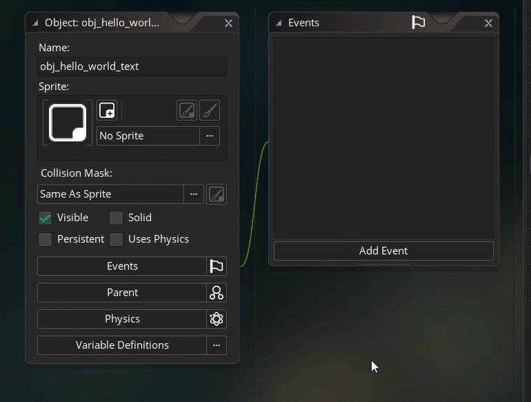
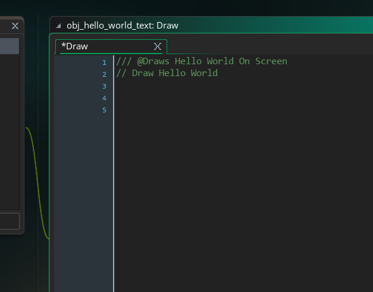
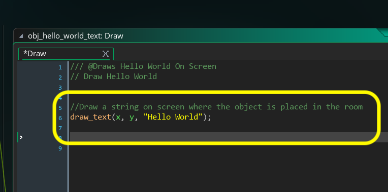
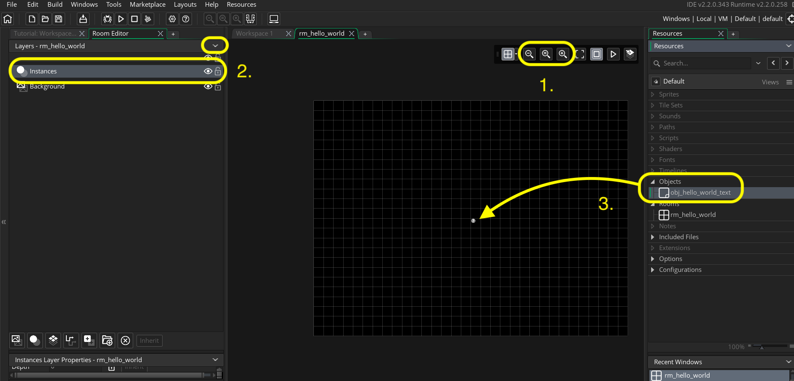

### GMS 2 Positioning Text


This tutorial is intended for those wanting an introduction to <i>GameMaker Studio 2</i> using their scrpting language <i>GML</i>. This assumes no prior knowledge of the software or scripting. This walk through looks at how to add text to a 2-D game level and position it in the dead center on screen.

* Tested on GameMake Studio2.3.5.589
* An existing [GML Project](https://github.com/maubanel/GMS2-Snippets/blob/main/rename-project/README.md#user-content-rename-gms2-project)

<br>

---


##### `Step 1.`\|`ITA`|:small_blue_diamond:

In GameMaker all of our resources are stored in the **Resources** menu.  By default it is in the right hand side of the screen (although you can change its location as these tabs can be redocked).  Each of these sections have a small triangle that can be expanded or minimized to show the assets of that class.  All of our art, audio, scripting and other elements will be stored here in the appropriate folder.  


All projects in **GameMaker Studio 2** start with a room called **room0**. A room represents a level of your game.  You can have multiple rooms thus multiple levels. If you don't see the room in the **Resources** menu then *press the right arrow* next to the **Rooms** title to open up all the rooms in this folder. Double left click **room0** to open it.  If you don't see the room in the editor, you can then *press the middle Zoom icon* with the **=** in it to reset the zoom level.


##### `Step 2.`\|`FHIU`|:small_blue_diamond: :small_blue_diamond: 

Now we should rename the room to something more appropriate.  It is a good idea to always preface the names with what Resource type we are using.  We will prepend the room names with `rm_` and call it `rm_hello_world` by *right clicking* on the room and selecting **Rename**</b> from the drop down menu and then type in the new name for the room.


##### `Step 3.`\|`ITA`|:small_blue_diamond: :small_blue_diamond: :small_blue_diamond:

Go to the **Resources** menu on the right and *right click* on the **Object** heading that is partially greyed out.  *Select* **Create Object**, this will add the default **Game Object** to our **Workspace**.  Notice that in our main window it has a tab that says **Workspace1**  This is the area where we will be customizing the game object.  Go to the **Name** input box and change the **Name** from **object1** to `obj_hello_world_text`.


##### `Step 4.`\|`ITA`|:small_blue_diamond: :small_blue_diamond: :small_blue_diamond: :small_blue_diamond:

Now we have a game object.  Normally we would attach an animation to it to play in the game.  In this case we will use the object to draw text on the screen.  GameMaker objects are controlled through [Object Events](https://manual.yoyogames.com/The_Asset_Editors/Object_Properties/Object_Events.htm)

> "These events fall into two categories: those that run every single game step, and those that are "triggered" by a game event, like the instance reaching the room edge or a keyboard or mouse press. - GameMaker Manual"

In this case we do not have any art to attach to the sprite so we will need to draw a font on screen through a script.  This is done through a **Draw** object event.  All the draw events are a type that run **every** step.  There are different types of draw events but the two we will care about now are **Draw** and **Draw GUI**.  **Draw GUI** will draw to the screen space and will be in the same portion of the camera regardless of where the camera is located in the level.  With a regular **Draw** event the draw will be relative to the room and will not move with the camera.  Since we want to place this text in the level we will use a draw event. *Double click* `obj_hello_world_text` to center it in our workspace. *Left click* on the **Add Event** button in the **Events** tab of the game object and select **Draw | Draw**. This will bring out a scripting window that will allow us to add some game logic to this event type.




##### `Step 5.`\|`ITA`| :small_orange_diamond:

This brings up a scripting tab (notice the green lines connect the related tabs together so you don't get confused).  This is where we add scripting for game logic.  The very first thing we are going to start with is add comments.  When you are starting out this is usually the part that is counter-intuitive.  When we write an essay we usually don't add comments to describe what we are writing.  
		
With game logic it is important to document what we are doing as if we come back to it in a few weeks, we will have forgot what we have done.  It is better to err on too many and verbose a comment than none at all.  It will not affect the performance of the game and the player will never end up seeing them (they will not get compiled into the playable build). Comments are not interpreted by the computer and don't turn into logic.  They are human readable and are for the development team.  

If you have two forward slashes `//` everything that follows on that line is a comment and in GameMaker's default settings turns green. This is for human reading and does not affect the game at all.  You can add as much as you will like.
		
I added:

```
/// @Draws Hello World On Screen
// Draw Hello World
```




##### `Step 6.`\|`ITA`| :small_orange_diamond: :small_blue_diamond:

To draw text to a screen we need to call a [Function](https://manual.yoyogames.com/#t=GameMaker_Language%2FGML_Overview%2FRuntime_Functions.htm&rhsearch=function&rhhlterm=function).  What is a function?  It is a way of allowing us to do a similar task over and over again without retyping all the code again.  If you are copying and pasting the same blocks of code to use in multiple places, you should consider turning it into a function.  

Think of the function as a factory.  That factory can receive input and it can output one thing for you.  For example we might have a function called `average(num, num, num ...)`.  This calls a function named **average** and will send it multiple numbers (the numbers passed in parenthesis).  Lets look at this in Pseudo Code:

```
average(3, 8, 10);
```

A function is a name followed by a set of parentheses.  Inside the parenthesis are **Parameters** that are passed to the function.  These are comma separated (spaces don't matter here).  In this case we are passing three number parameters to this function. This function would return the average of these three numbers (the equivalend of (3 + 8 + 10) / 3) which is 7.

In our case we will be calling a function named **[draw_text](https://manual.yoyogames.com/#t=GameMaker_Language%2FGML_Reference%2FDrawing%2FText%2Fdraw_text.htm&rhsearch=draw_text&rhhlterm=draw_text)**. This takes three arguments.  It takes an **x** position in the room, a **y** position in the room and a **string** (a group of letters, numbers and symbols). Lets now call this function.  For the **x** and **y** argument we will not pass it numbers.  Please note that if you look at the help menu that this function does not return any value (the manual says it returns **NA** - not applicable).
		
We will use the **x** and **y**  position of the object in the room.  There are two built in variables in each game object and this is its x,y position in room space.  So type in **obj_hello_world_text: Draw** event:




##### `Step 7.`\|`ITA`| :small_orange_diamond: :small_blue_diamond: :small_blue_diamond:

The above should draw the text "Hello World" (without quotation marks) in the room.  But first we need to drag this game object in the room so it knows to run this game object in this level we previously named. So we *double left click* on the **rm_hello_world** to go back (or reopen) the room.  *Adjust* the zoom so you can see the entire room as we want to *drag* the game object in the center.  Make sure the **Layers** tab in open in the **Room Editor** and that you highlight **Instances** layer.  You can only add game objects onto an instance layer (you can have more than one layer of course).  Then drag and drop a single instance of **obj_hello_world_text** into the main game window in as close to the center as you can make it:




##### `Step 8.`\|`ITA`| :small_orange_diamond: :small_blue_diamond: :small_blue_diamond: :small_blue_diamond:


##### `Step 9.`\|`ITA`| :small_orange_diamond: :small_blue_diamond: :small_blue_diamond: :small_blue_diamond: :small_blue_diamond:


##### `Step 10.`\|`ITA`| :large_blue_diamond:


##### `Step 11.`\|`ITA`| :large_blue_diamond: :small_blue_diamond: 


##### `Step 12.`\|`ITA`| :large_blue_diamond: :small_blue_diamond: :small_blue_diamond: 


##### `Step 13.`\|`ITA`| :large_blue_diamond: :small_blue_diamond: :small_blue_diamond:  :small_blue_diamond: 


##### `Step 14.`\|`ITA`| :large_blue_diamond: :small_blue_diamond: :small_blue_diamond: :small_blue_diamond:  :small_blue_diamond: 


##### `Step 15.`\|`ITA`| :large_blue_diamond: :small_orange_diamond: 


##### `Step 16.`\|`ITA`| :large_blue_diamond: :small_orange_diamond:   :small_blue_diamond: 


##### `Step 17.`\|`ITA`| :large_blue_diamond: :small_orange_diamond: :small_blue_diamond: :small_blue_diamond:


##### `Step 18.`\|`ITA`| :large_blue_diamond: :small_orange_diamond: :small_blue_diamond: :small_blue_diamond: :small_blue_diamond:


##### `Step 19.`\|`ITA`| :large_blue_diamond: :small_orange_diamond: :small_blue_diamond: :small_blue_diamond: :small_blue_diamond: :small_blue_diamond:


##### `Step 20.`\|`ITA`| :large_blue_diamond: :large_blue_diamond:


##### `Step 21.`\|`ITA`| :large_blue_diamond: :large_blue_diamond: :small_blue_diamond:


___


| [previous](../)| [home](../README.md#user-content-ue4-animations) | [next](../)|
|---|---|---|
